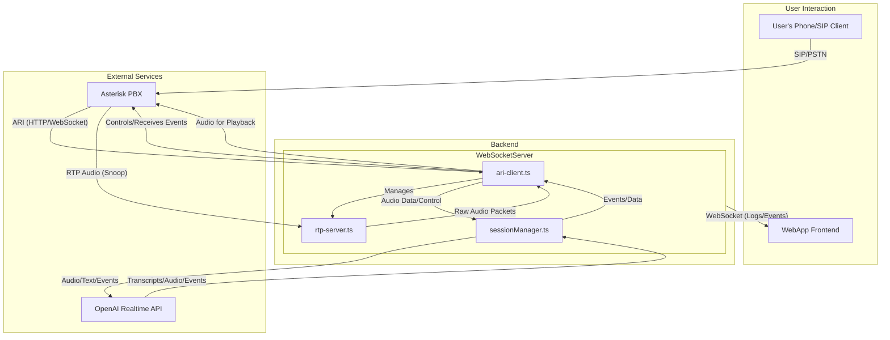
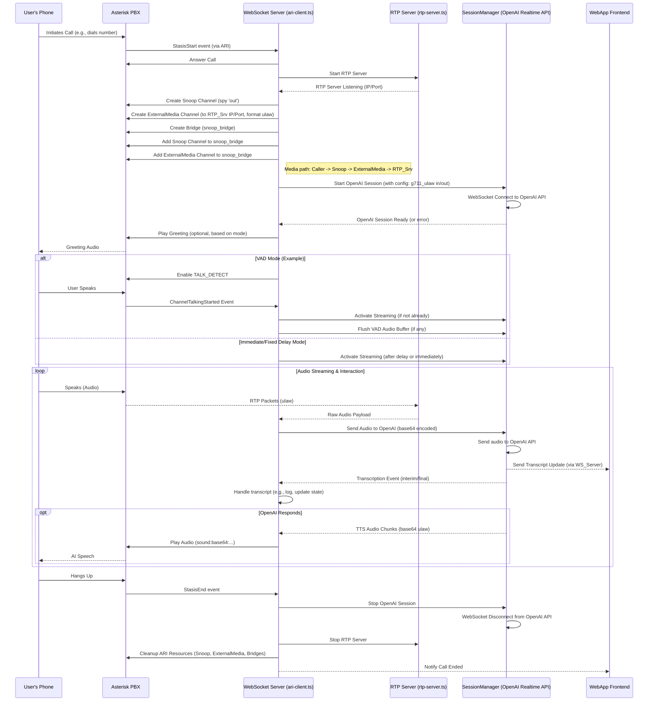

# System Architecture: Realtime Voice Agent with Asterisk and OpenAI

This document outlines the architecture of the Realtime Voice Agent system, which integrates Asterisk for telephony, a WebSocket server for backend logic and API communication, and OpenAI's Realtime API for speech-to-text and text-to-speech capabilities. A web application serves as the user interface for configuration and monitoring.

## Components Overview

The system is composed of the following major components:

1.  **Asterisk PBX**:
    *   Handles all PSTN/VoIP call control (setup, teardown).
    *   Manages audio streams to and from the caller.
    *   Interacts with the `websocket-server` via the Asterisk REST Interface (ARI).
    *   Provides Voice Activity Detection (VAD) events.

2.  **WebSocket Server (`websocket-server`)**:
    *   A Node.js application acting as the central hub.
    *   **ARI Client (`ari-client.ts`)**: Connects to Asterisk, manages call lifecycle (answering, snooping, playing audio), and handles operational modes (VAD, immediate, DTMF).
    *   **RTP Server (`rtp-server.ts`)**: A simple UDP server that receives raw audio packets (expected to be G.711 µ-law) from Asterisk's external media channel.
    *   **Session Manager (`sessionManager.ts`)**: Manages the WebSocket connection to OpenAI's Realtime API. It handles session setup, streams audio to OpenAI, processes responses (transcripts, TTS audio), and manages function calls.
    *   **Configuration Management**: Loads settings from `config/default.json` and environment variables.
    *   **Frontend WebSocket**: Provides a WebSocket endpoint (e.g., `/logs`) for the `webapp` to receive real-time updates like transcripts and call status.

3.  **OpenAI Realtime API**:
    *   Provides speech-to-text (STT) capabilities, converting audio streamed from the `websocket-server` into text.
    *   Provides text-to-speech (TTS) capabilities, generating audio from text provided by the AI model.
    *   Handles the core conversational AI logic using a specified model (e.g., GPT-4o).

4.  **Web Application (`webapp`)**:
    *   A Next.js frontend application.
    *   Allows users to configure call parameters (e.g., AI instructions, voice).
    *   Displays live transcripts and function call interactions received from the `websocket-server`.

## Diagrams

### 1. Component Diagram

This diagram shows the main components and their primary interactions.



### 2. Call Flow Sequence Diagram (Simplified)

This diagram illustrates a typical call flow.



### 3. Audio Flow Diagram

This diagram focuses specifically on how audio data moves through the system.

```mermaid
graph TD
    subgraph UserSide as "User's Phone"
        A[Microphone] --> B(SIP Client/Handset)
    end

    subgraph AsteriskSystem as "Asterisk PBX"
        C[SIP Endpoint/Channel]
        D[Snoop Channel (spy='out')]
        E[External Media Channel (format=ulaw)]
        F[ARI Playback]
    end

    subgraph WebSocketServerApp as "WebSocket Server"
        G[RTP Server (rtp-server.ts)]
        H[ARI Client (ari-client.ts)]
        I[Session Manager (sessionManager.ts)]
    end

    subgraph OpenAIService as "OpenAI Realtime API"
        J[STT Service]
        K[LLM/NLU]
        L[TTS Service]
    end

    B -- Voice (e.g., G.711 ulaw) --> C
    C --> D
    D -- Audio Copy --> E
    E -- RTP (ulaw) --> G
    G -- Raw ulaw Packets --> H
    H -- Audio Buffer --> I
    I -- base64(ulaw) --> J
    J -- Text --> K
    K -- Text for Response --> L
    L -- base64(ulaw) --> I
    I -- base64(ulaw) --> H
    H -- Playback (sound:base64:...) --> F
    F -- Audio --> C
    C -- Audio --> B

    style UserSide fill:#dae8fc,stroke:#333,stroke-width:2px
    style AsteriskSystem fill:#d5e8d4,stroke:#333,stroke-width:2px
    style WebSocketServerApp fill:#ffe6cc,stroke:#333,stroke-width:2px
    style OpenAIService fill:#f8cecc,stroke:#333,stroke-width:2px
```

## Key Design Considerations

*   **Real-time Communication:** WebSockets are used for communication between the `websocket-server` and OpenAI Realtime API, as well as between the `websocket-server` and the `webapp` for live updates.
*   **Audio Passthrough:** The system is designed to pass G.711 µ-law audio directly from Asterisk to OpenAI and from OpenAI back to Asterisk, minimizing transcoding within the Node.js application. This relies on Asterisk handling any necessary transcoding at the endpoint level (e.g., for SIP devices not using ulaw).
*   **Modularity:** The `websocket-server` is broken down into modules (`ari-client.ts`, `rtp-server.ts`, `sessionManager.ts`) for better organization and maintainability.
*   **Configuration Driven:** Most operational parameters, API keys, and connection details are configurable via environment variables and a JSON configuration file.
*   **State Management:** The `ari-client.ts` manages the state of active calls, including associated resources and timers. `sessionManager.ts` manages the state of OpenAI WebSocket connections.
*   **Error Handling and Resilience:** Try-catch blocks and event handlers are used to manage errors gracefully and ensure resources are cleaned up.

This architecture allows for a flexible and performant voice agent capable of real-time interaction with users via traditional telephony infrastructure.
